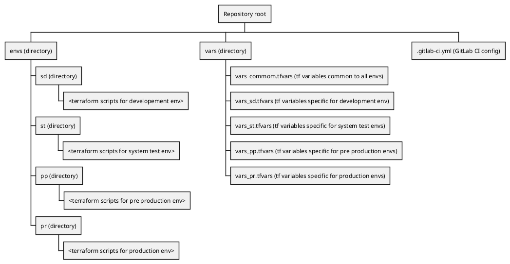

# Terraform IaC template

This project can be used to provision infrastructure using Terraform scripts.

The project repository is organized in order to provision and manage infrastructure on up to four environments: (Development, System Test, Pre Production, Production) on Azure Subscriptions.

The project contains:

- example terraform scripts which deploy an Azure MySQL
- GitLab CI pipeline (centrally managed) which orchestrate the Terraform validate / plan / apply actions

## Repository sctructure

The repository is organised with a directory structure, **which must not be altered** in order to have the GitLab I pipeline to work:

## Branching model

The repository uses Git branches to address changes to environments. There must be exaclty as many branches named as the target environments:

- `sd` - Developement Environment
- `st` - Developement Environment
- `pp` - Pre Production Environment
- `pr` - Pre Production

## Terraform code and Modules

It is strongly recommended to use [available Terraform Modules](https://gitlab-dgt.eni.com/infra/modules) in terraform scripts.

If a module is not available for the required set of resources, it's condidered a beste practice to organize the code as a module itself.

See official Terraform docs on [language](https://www.terraform.io/docs/language/index.html), [modules](https://www.terraform.io/docs/language/modules/index.html) and the [AzureRM terraform provider](https://registry.terraform.io/providers/hashicorp/azurerm/latest/docs).

## Instantiation of the template

Once the template is instantiated (usually under the **Configuration Management** group) a [GitLab Project Access Token](https://docs.gitlab.com/ee/user/project/settings/project_access_tokens.html) must be created, with `api` permission and name `TF_PASSWORD`.

The token value must be saved under an environment variable in the [project CI/CD variables](https://docs.gitlab.com/ee/ci/variables/#add-a-cicd-variable-to-a-project), with the name `TF_PASSWORD`.

## How to provision infrastructure

The provisioning of infrastructure, as well as any changes to environments, is managed by creating Merge requests.

For example, to make a change to the Development Environment:

1. create a branch from `sd` named `feat/<name of required change>`
1. updates the branch `feat/<name of required change>` with required changes
1. create a merge request targeting the `sd` branch

When the merge request is created, it will start a GitLab CI pipeline with **test** and **build** stages, which will perform a [Terraform validate](https://www.terraform.io/docs/cli/commands/validate.html) and a [Terraform plan](https://www.terraform.io/docs/cli/commands/plan.html) commands.

The output of the Terraform plan command will produce a short report about the actual changes that will take place on the infrastructure. The report can be viewed directly in the merge request. A complete report of terraform plan output can be viewed in the pipeline output associated to the merge request.

If the merge request pipeline succeeds and the plan report is correct (the changes are what they should be), the Merge request can be accepted and merged in the target branch.

When the merge request is accepted (merged), a new pipeline will start, this time with a final stage which will include the **Terraform apply** command.

**Please note:** any change affecting the file `vars_common.tfvars` must be merged from the Development Environment branch `sd` to all other branches: `st`, `pp`, `pr`.

## Other general rules

- The git repository **must not contain any secret**
- The git repository **must not contain any binary file**
